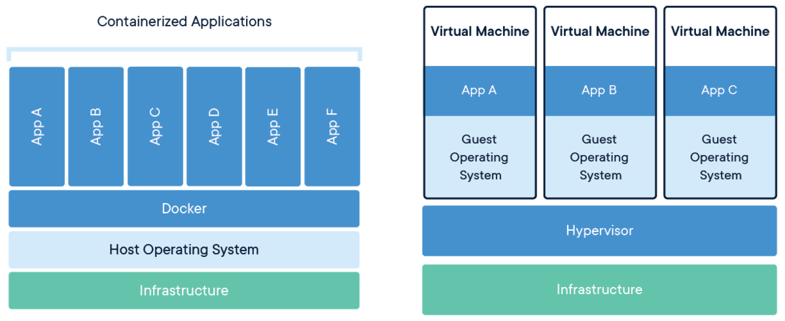

# Chapter 1 - What is Docker?

## Containers vs. Virtual Machines

### Virtual Machines

Virtual machines were created in order to:

- Get better hardware utilisation
- Application isolation
- Better failure tolerance

But they had drawbacks:

- Heavyweight, you're dragging around whole operating system
- Slow, starting an operating system from scratch
- Require specialised skills, application developers usually aren't experts in operating system automation

### Containers

But what if we shared the operating system, and instead focused the isolation one level higher?

By using the "magic" of the Linux kernel, Docker containers were born. Instead of carting around an entire operating system, instead system calls are passed through. This means we can be *fast*.

Although the kernel constructs that allow for containers were put there in part by Google in the early 2000's, the real trick that made Docker is the developer experience. The barrier to entry is much lower, without losing much of the power.

 
 
 
 

## Containers in your Workplace

Discuss and write down how you think containers may help you and your organisation:
